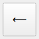
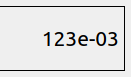

# Калькулятор

## https://github.com/InAnotherLife/Calculator

## Стек: С++, Qt, паттерн MVC
## 1. Описание
Калькулятор разработан на языке С++ стандарта C++17. Графический интерфейс создан при помощи фреймворка Qt версии 6.2. Программа реализована с использованием паттерна MVC.  
Код калькулятора находится в папке src. Сборка программы осуществляется с помощью Makefile (цели all, install, uninstall, dist, tests, gcov_report, clean).  
Обеспечено покрытие кода unit-тестами с помощью библиотеки GTest.

## 2. Особенности калькулятора
Оператор умножения * можно не ставить перед скобкой.

        2(1+1)=4
        cos0(2+2)=4
Калькулятор поддерживает унарные плюс и минус.

        2+-2=0
        2-+2=4
        2(-2+2)=0
        -2*2=-4
        -2=-2
При этом ввод трех и более операторов подряд не допускается.

        2+-+2=Syntax error
        2**/*2=Syntax error
Оператор степени ^ - правоассоциативный оператор.

        2^3^4=2,4*10^24
Чтобы сделать степень левоассоциативным оператором, необходимо в файле Model/calculator.cc заменить строку:

        if (str[i] != '(' && str[i] != '^')
на строку:

        if (str[i] != '(')
Тогда:

        2^3^4=4096

Вычисление производится после ввода выражения и нажатия на кнопку =.  
Затем можно продолжить вычисление, выбрав один из операторов: /, *, +, -, ^y или (.  
Чтобы стереть один символ, нужно нажать на кнопку:

Калькулятор поддерживает ввод чисел в формате научной нотации:

